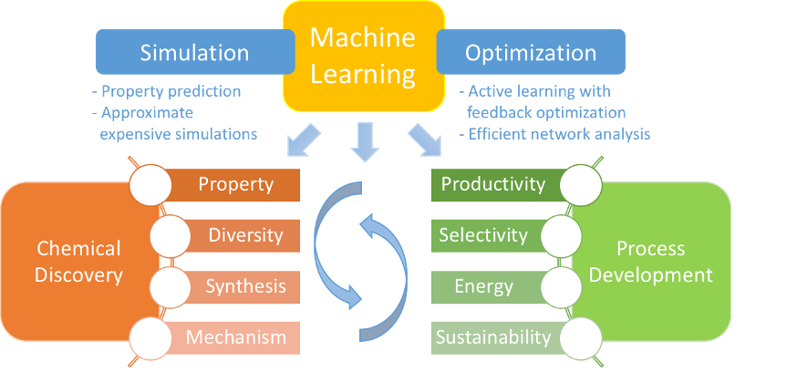

---
# Leave the homepage title empty to use the site title
title: Research
date: 2022-10-24
type: landing

sections:
  - block: markdown
    content: 
      title: | 
        <h1 text-align: center;">Research</h1>
      subtitle: | 
        <h2 style="font-size: 28px; text-align: left;">Overview</h2>
      text: |
        - 
Innovations in chemistry have been a strong propellent to solving important challenges in energy, environment and health. The lifecycle of chemical innovation includes molecular discovery, reaction engineering, and process design and optimization. Computational modeling has played an important role in this process, but challenges still exist in different aspects. First, the scope and complexity of the molecules and chemistry are rapidly increasing. Efficient and rational exploration of the chemical space is desired in order to maximize the likelihood of success. 

        - 
We are broadly interested in developing and applying various modeling techniques in chemical engineering. In particular, recent advances in machine learning demonstrated its potential in elucidating complicated patterns, simplifying or replacing computationally intensive simulations, and optimizing long, sequential decision making processes. We are excited about combining machine learning and other modeling techniques to solve problems spanning different stages and scales, including chemical discovery and planning, reaction engineering and process design and optimization. 

        <figure style="text-align: center;"></figure>

  - block: markdown
    content: 
      title: | 
        <h2 style="font-size: 28px; text-align: left;">Machine Learning for Polymer Design and Optimization​</h2> 
      text: |
        - 
Polymers are an important class of materials that are ubiquitous, affecting almost all industries and everyday lives to an extraordinary extent. However, the polymer space is still underexplored; variability of both the structure of monomers and polymerization methods makes the space infinitely large. We aim to build a computational pipeline to help develop new polymers that have improved properties, while the monomers are synthetically accessible and the polymerization/depolymerization reactions can be simulated. 

        <figure style="text-align: center;"></figure>
  - block: markdown
    content: 
      title: | 
        <h2 style="font-size: 28px; text-align: left;">Machine Learning for Polymer Design and Optimization​</h2> 
      text: |
        - 
Mechanistic understanding of chemical reactions equips chemical engineers with the power to optimize reaction conditions to maximize the yield of desired products and reduce by-product formation, and it is desirable in many fields including biomass conversion and catalytic reaction systems. The computational search of reaction mechanisms can be challenging due to the large search space. We aim to use reinforcement learning methods to focus on feasible and productive elementary reaction steps, thus accelerating reaction mechanism search. It can potentially be applied to combustion chemistry, organic synthesis and atmospheric chemistry, etc. 

        <figure style="text-align: center;"></figure>
  - block: markdown
    content: 
      title: | 
        <h2 style="font-size: 28px; text-align: left;">Machine Learning for Polymer Design and Optimization​</h2> 
      text: |
        - 
The discovery of small molecules is a topic of long-lasting interest in chemistry. Inevitably, the newly discovered molecules will need to have a scaled-up process in order to be practically useful. Traditionally, molecular discovery and process development are separated phases, but many times it is difficult or even impossible to boost the yield of the discovery-stage chemistry to satisfy production demand with simple modifications followed by process optimization. We aim to tackle this problem combining retrosynthesis, machine learning, process simulation and optimization. 

        <figure style="text-align: center;"></figure>

---